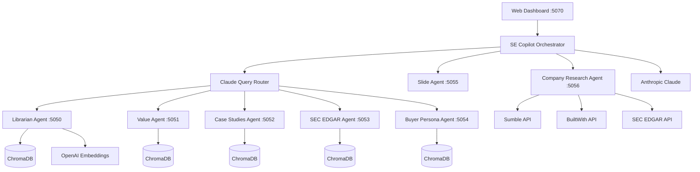

# SE Copilot

AI-powered Sales Engineering Copilot — a multi-agent system that automates account research, pre-call preparation, demo planning, and deal intelligence for Sales Engineers.

## Architecture

SE Copilot orchestrates a fleet of specialized RAG agents and LLM-powered synthesizers behind a central FastAPI service.



**Orchestrator** (`se-copilot/`) — Central FastAPI service that routes queries, coordinates agents, synthesizes responses via Claude, and serves the web dashboard. Instrumented with Datadog LLM Observability.

**RAG Agents** (`agents/rag/`) — Configurable ChromaDB-backed retrieval agents sharing a single codebase, parameterized by YAML configs:

| Agent | Port | Knowledge Base |
|-------|------|---------------|
| Librarian | 5050 | Product docs, API specs, technical architecture |
| Value | 5051 | Case studies, customer stories, ROI evidence |
| Case Studies | 5052 | Named customer references with quantified outcomes |
| SEC EDGAR | 5053 | Parsed 10-K annual filings (searchable by ticker) |
| Buyer Persona | 5054 | Role-specific discovery tactics, KPIs, objection handling |

**Company Research Agent** (`agents/company_research/`) — Automated company intelligence via SEC EDGAR, Sumble, and BuiltWith APIs with confidence-tiered tech stack detection.

**Slide Generation Agent** (`agents/slides/`) — Generates presentation decks from demo plans using Claude.

## Capabilities

- **Strategic Query Engine** — Intelligent routing (technical, value, or both) with persona-aware synthesis and talk tracks
- **Sales Hypothesis Generation** — Automated account hypotheses combining company research, tech stack analysis, and internal knowledge
- **Account Expansion Playbooks** — Data-driven cross-sell/upsell recommendations mapped to buyer personas
- **Demo Story Planner** — Persona-tailored demo narratives with loop-by-loop structure
- **Pre-Call Briefs** — Structured preparation documents pulling from all account artifacts
- **Call Note Summarization** — Transcript-to-structured-summary with PDF export
- **Deal Snapshots & Next Steps** — AI-synthesized deal health assessments with recommended actions
- **Release Digest Generator** — Customer-personalized release notes matched to account context
- **Company Chat** — Conversational interface grounded in all account artifacts
- **Company CRM** — Lightweight account management with artifact linking

## Prerequisites

- **Python 3.13+**
- **WeasyPrint system dependencies** (for PDF generation):
  ```bash
  # macOS
  brew install cairo pango gdk-pixbuf libffi

  # Ubuntu/Debian
  sudo apt-get install libcairo2-dev libpango1.0-dev libgdk-pixbuf2.0-dev libffi-dev
  ```
- **Playwright** (optional, for web-based content ingestion):
  ```bash
  playwright install
  ```

## Quick Start

### 1. Clone and configure environment

```bash
git clone <your-repo-url> se-copilot
cd se-copilot

# Create your root .env from the template
cp .env.example .env
# Edit .env and add your OPENAI_API_KEY and ANTHROPIC_API_KEY (required)
```

### 2. Create Python virtual environments

Each service has its own venv and dependencies:

```bash
# RAG agents (librarian, value, case_studies, sec_edgar, buyer_persona)
python3 -m venv agents/rag/.venv
agents/rag/.venv/bin/pip install -r agents/rag/requirements.txt

# Slide generation agent
python3 -m venv agents/slides/.venv
agents/slides/.venv/bin/pip install -r agents/slides/requirements.txt

# Company research agent
python3 -m venv agents/company_research/.venv
agents/company_research/.venv/bin/pip install -r agents/company_research/requirements.txt

# SE Copilot orchestrator
python3 -m venv se-copilot/.venv
se-copilot/.venv/bin/pip install -r se-copilot/requirements.txt
```

### 3. Populate knowledge bases

The RAG agents start with empty ChromaDB collections. You need to ingest content before queries will return results. See [Knowledge Base Setup](#knowledge-base-setup) below.

### 4. Start all services

```bash
./start_all.sh
```

This launches all 8 services in the background. Services with missing venvs are skipped. Logs are written to `logs/<service>.log`.

Open the dashboard at **http://localhost:5070**.

### 5. Stop all services

```bash
./start_all.sh stop
```

## Services

| Service | Port | Directory | Description |
|---------|------|-----------|-------------|
| Librarian | 5050 | `agents/rag/` | Technical documentation RAG |
| Value | 5051 | `agents/rag/` | Business value and ROI RAG |
| Case Studies | 5052 | `agents/rag/` | Customer case studies RAG |
| SEC EDGAR | 5053 | `agents/rag/` | SEC 10-K filing analysis RAG |
| Buyer Persona | 5054 | `agents/rag/` | Buyer persona intelligence RAG |
| Slides | 5055 | `agents/slides/` | Slide deck generation |
| Company Research | 5056 | `agents/company_research/` | Company intelligence aggregation |
| SE Copilot | 5070 | `se-copilot/` | Orchestrator, synthesis, and web UI |

All RAG agents share the same codebase (`agents/rag/`), parameterized by YAML configs in `agents/rag/agents/`. ChromaDB runs in embedded mode — no external Chroma server is needed.

## Environment Variables

All services read from the root `.env` file. Per-service `.env` files can override specific values.

### Required

| Variable | Used By | Purpose |
|----------|---------|---------|
| `OPENAI_API_KEY` | RAG agents | Text embeddings (text-embedding-3-small) |
| `ANTHROPIC_API_KEY` | All services | Claude LLM for routing, synthesis, and generation |

### Optional

| Variable | Default | Purpose |
|----------|---------|---------|
| `CLAUDE_MODEL` | `claude-sonnet-4-6` | Claude model for all LLM calls |
| `TECHNICAL_AGENT_URL` | `http://localhost:5050/api/query` | Librarian agent endpoint |
| `VALUE_AGENT_URL` | `http://localhost:5051/api/query` | Value agent endpoint |
| `CASE_STUDIES_AGENT_URL` | *(empty — disabled)* | Case studies agent endpoint |
| `SEC_EDGAR_AGENT_URL` | *(empty — disabled)* | SEC EDGAR agent endpoint |
| `BUYER_PERSONA_AGENT_URL` | *(empty — disabled)* | Buyer persona agent endpoint |
| `SLIDE_AGENT_URL` | *(empty — disabled)* | Slide generation endpoint |
| `COMPANY_RESEARCH_AGENT_URL` | *(empty — disabled)* | Company research endpoint |
| `ROUTER_TIMEOUT_SECONDS` | `10` | Timeout for query routing |
| `AGENT_TIMEOUT_SECONDS` | `30` | Timeout for agent queries |
| `LOG_LEVEL` | `INFO` | Logging level |
| `DATADOG_API_KEY` | *(empty)* | Datadog LLM Observability |
| `DATADOG_APP_KEY` | *(empty)* | Datadog MCP integration |
| `SUMBLE_API_KEY` | *(empty)* | Sumble company enrichment |
| `BUILTWITH_API_KEY` | *(empty)* | BuiltWith tech stack detection |

When an optional agent URL is left empty, the orchestrator gracefully skips that agent — no errors, just fewer data sources in the synthesis.

## Knowledge Base Setup

Each RAG agent has its own ChromaDB collection stored under `agents/rag/data/<agent>/chroma_data/`. Content is ingested via `agents/rag/ingest.py`.

### Ingest local files

Place `.md` or `.txt` files in the agent's knowledge base directory, then run ingestion:

```bash
cd agents/rag

# Ingest all files for the librarian agent
.venv/bin/python ingest.py --agent librarian

# Ingest a specific subdirectory
.venv/bin/python ingest.py --agent value --path knowledge_base/blog_posts
```

### Ingest from a URL

```bash
cd agents/rag
.venv/bin/python ingest.py --agent value --url "https://www.datadoghq.com/blog/some-post/"
```

### Crawl a site prefix

```bash
cd agents/rag
.venv/bin/python ingest.py --agent value \
  --crawl "https://www.datadoghq.com/blog/" \
  --max-pages 200
```

### Sitemap-driven ingestion

```bash
cd agents/rag
.venv/bin/python ingest.py --agent librarian \
  --sitemap "https://docs.datadoghq.com/en/sitemap.xml" \
  --crawl "https://docs.datadoghq.com/" \
  --max-pages 500
```

### Incremental sync (librarian docs)

After the initial crawl, keep the librarian knowledge base up to date with incremental syncs:

```bash
cd agents/rag
.venv/bin/python sync_docs.py --agent librarian              # incremental
.venv/bin/python sync_docs.py --agent librarian --dry-run    # preview only
.venv/bin/python sync_docs.py --agent librarian --force      # full re-fetch
```

### SEC EDGAR filings

SEC 10-K filings can be ingested via the SEC EDGAR agent's web UI at `http://localhost:5053`, or through the orchestrator's API:

```bash
curl -X POST http://localhost:5070/api/edgar/ingest \
  -H "Content-Type: application/json" \
  -d '{"ticker": "AAPL", "cik": "0000320193"}'
```

### Knowledge base directory structure

```
agents/rag/data/
  librarian/
    knowledge_base/     # Place .md/.txt files here
    chroma_data/        # Auto-created ChromaDB storage
    conversations.db    # Auto-created chat history
  value/
    knowledge_base/
    chroma_data/
  case_studies/
    knowledge_base/
    chroma_data/
  sec_edgar/
    knowledge_base/     # 10-K filings organized by ticker
    chroma_data/
  buyer_persona/
    knowledge_base/
    chroma_data/
```

## API Overview

The orchestrator at `http://localhost:5070` exposes the following key endpoints:

| Method | Endpoint | Description |
|--------|----------|-------------|
| `POST` | `/api/query` | Route a question to RAG agents and synthesize a response |
| `POST` | `/api/hypothesis` | Generate a sales hypothesis for a company |
| `POST` | `/api/expansion-playbook` | Generate an account expansion playbook |
| `POST` | `/api/demo-plan` | Generate a persona-tailored demo story |
| `POST` | `/api/precall-brief` | Generate a pre-call preparation brief |
| `POST` | `/api/call-notes` | Summarize a call transcript |
| `POST` | `/api/next-steps` | Generate recommended next steps for a deal |
| `POST` | `/api/release-digest` | Generate a personalized release notes digest |
| `POST` | `/api/deal-snapshot` | Generate a deal health snapshot |
| `POST` | `/api/company-chat` | Send a message in a company-scoped chat |
| `POST` | `/api/debrief` | Compare a pre-call brief against a call note |
| `GET`  | `/api/health` | Health check for all services |
| `GET`  | `/api/inventory` | List all agents with status and stats |
| `GET`  | `/api/companies` | List all tracked companies and their artifacts |

All generated artifacts (hypotheses, demo plans, call notes, briefs, etc.) have full CRUD endpoints for listing, retrieving, and deleting.

## Development

### Running tests

```bash
cd se-copilot
.venv/bin/python -m pytest tests/
```

### Viewing logs

```bash
# All services
tail -f logs/*.log

# Single service
tail -f logs/librarian.log
```

### Running a single agent manually

```bash
cd agents/rag
.venv/bin/python web.py --agent librarian
```

### Project structure

```
.
├── .env.example              # Root environment template
├── start_all.sh              # Launch/stop all services
├── agents/
│   ├── rag/                  # Shared RAG agent codebase
│   │   ├── agents/           # Per-agent YAML configs
│   │   ├── web.py            # FastAPI server (one per agent)
│   │   ├── ingest.py         # Document ingestion pipeline
│   │   ├── sync_docs.py      # Incremental doc sync
│   │   ├── query.py          # Retrieval and LLM query logic
│   │   └── chat.py           # Multi-turn chat
│   ├── slides/               # Slide generation agent
│   │   └── main.py
│   └── company_research/     # Company intelligence agent
│       ├── router.py         # Research pipeline orchestrator
│       ├── sumble_client.py  # Sumble API client
│       ├── edgar_client.py   # SEC EDGAR API client
│       └── builtwith_client.py
└── se-copilot/               # Orchestrator and web UI
    ├── main.py               # FastAPI app with all endpoints
    ├── router.py             # Claude-powered query classifier
    ├── synthesizer.py        # Response synthesis
    ├── retriever.py          # Multi-agent retrieval
    ├── config.py             # Settings (env vars)
    ├── static/               # Web dashboard frontend
    └── demo_story/           # Demo plan generation sub-package
```

## License

Apache 2.0
